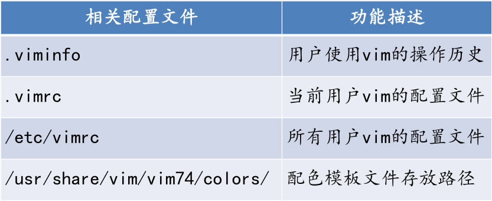
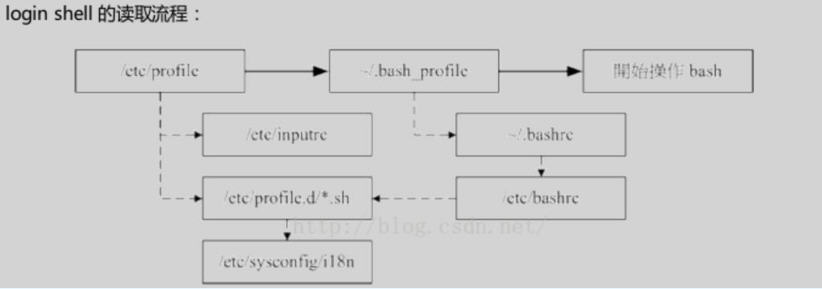
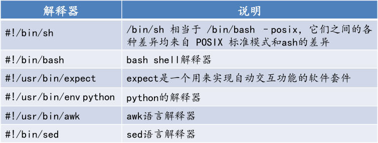
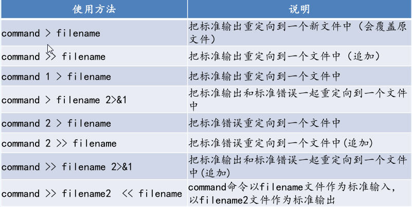
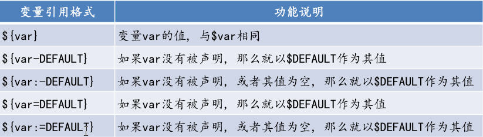
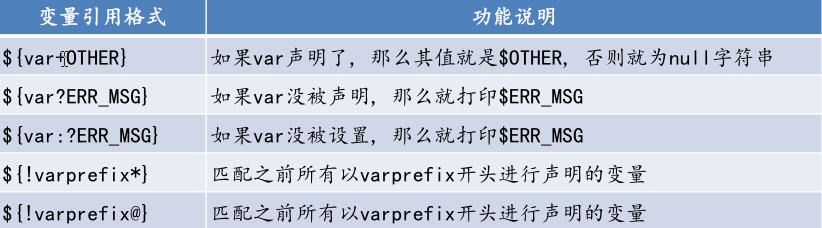
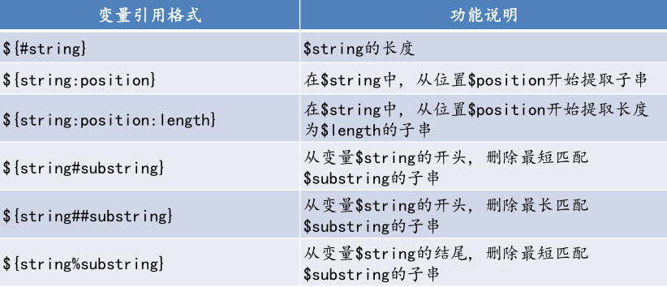
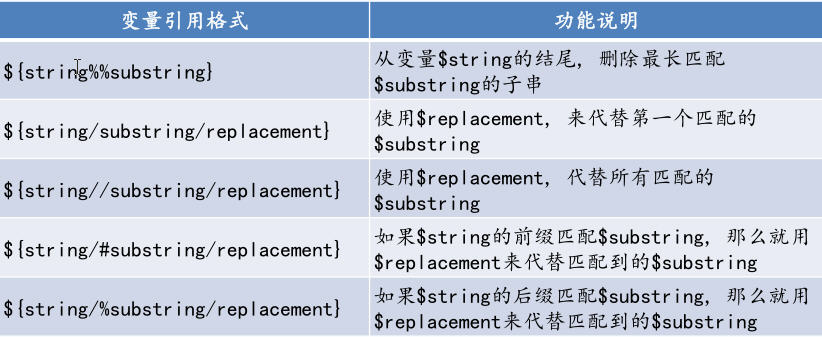

# 一 shell高级应用指南
---
### 1.1 什么是shell:
>Shell是一个命令解释器，它在操作系统的最外层，负责
>直接与用户对话，把用户的输入提交给系统，并将结果输出到
>屏幕返回给用户。这种对话方式可以是交互式的方式（从键盘
>输入命令，可以立即得到shell的回应），或非交互式（脚本）
>的方式。  

--- 
### 1.2 shell 的特性:

* 把已有命令进行适当组合构成新的命令
* 提供了文件名扩展字符（通配符，如* 、 ?、 [ ]），
使得用单一的字符串可以匹配多个文件名，省去键入一长串
文件名的麻烦
* 可以直接使用Shell的内置命令,而不需创建新的进程，
如Shell中提供的cd、echo、exit、pwd、kill等命令。为防
止因某些Shell不支持这类命令而出现麻烦，许多命令都提
供了对应的二进制代码，从而也可以在新进程中运行
* Shell允许灵活地使用数据流，提供通配符、输入/输出
重定向、管道线等机制，方便了模式匹配、I/O处理和数据
传输 
* 结构化的程序模块，提供了顺序流程控制、条件控制、
循环控制等
* Shell提供了在后台执行命令的能力
* Shell提供了可配置的环境，允许创建和修改命令、命令
提示符和其它的系统行为
* Shell提供了一个高级的命令语言，能够创建从简单到复
杂的程序。利用Shell脚本，可把用户编写的可执行程序与
Unix命令结合在一起，当作新的命令使用，从而便于用户开
发新的命令    

--- 
### 1.3 什么是shell脚本:

>Shell脚本与Windows/Dos下的批处理很相似，它将各类命
令预先放入到一个文件中，最终形成一个方便一次性执行的程
序文件。
Shell脚本是利用shell的功能编写而成，其使用纯文本文
件，将一些shell的语法与指令写在里面，结合正则表达式、管
道命令、数据流重定向及控制流程等功能，实现我们所想要达
到的处理目的  

---

### 1.4 工作中使用 shell 脚本的好处

* 1）减少重复劳动，提高工作效率    
* 2）规范我们的工作方式，保证结果的正确性    
* 3）便于提供给他人使用    

--- 

### 1.5 vim 最强大的文本编辑器

>Vim是基于vi发展出来的一个文本编辑器,所有Unix like系
统都内置vi编辑器，而Vim的在vi这个得天独厚的优势之上又进
行了增强，包括语法加亮，代码补全,支持分屏等功能。可以说
Vim是Linux下运维人员最给力的文本编辑器工具   

---

### 1.6 Shell 环境 – 常见配置文件介绍   
> 1） 登陆shell模式下    
   
* /etc/profile 应用于所有用户的全局配置文件   
* ~/.bash_profile用户个人配置文件，会重写全局配置文   
件中相同元素的内容

> 2）非登陆shell模式下

* /etc/bashrc 应用于所有用户的全局配置文件
* ~/.bashrc用户个人配置文件，会重写全局配置文
件中相同元素的内容  

### 1.7 alias常见的用法 
  

### 1.8 创建第一个脚本 
<pre>
mkdir /server/scripts/ -p
cd /server/scripts/
touch hello_world.sh
#!/bin/bash 脚本解释器
#--------------------------------------------
# Filename: hello_world.sh 注释脚本名称
# Description: print the hello world string 脚本描述
# Revsion: 1.0 脚本的版本
# Date: 2016/08/07 脚本创建及更新日期
# Auther: xxx 脚本作者
# Email: xxx@163.com 作者邮箱
# Notes: this is my first shell 注意及其他标注
#---------------------------------------------
#-----------------main------------------------
echo “hello world！”
</pre>
### 1.8 常见脚本解释器  

### 1.9 如何操作 Shell 的 I/O
#### 1.9.1 命令方式
* echo
<pre>

可以显示文本、变量或者把字符串输入到文件
格式：
echo [options] string
功能：
\c：不换行
\t：制表符
\n：换行
参数：
-n：禁止echo命令输出后换行
-e：使转义符生效
</pre>

* read 
<pre>
可以从键盘或文件的某一行文本中读入信息，并将其赋给一个变量
格式：
read [options] varible1 varible2 …
参数：
-p：显示readline内容
-t：输入剩余时间
-u: 绑定文件描述符作为输入
</pre>

* cat 
<pre>
可以用来显示文件内容，创建文件，还可以用它来显示控制字符。
格式：
cat [options] filename1 filename2 …
参数：
-v：显示控制字符
创建文件：cat > filename
</pre>

* tee
<pre>
它把输出的一个副本输送到标准输出，另一个副本拷贝到相应的文件中。
格式：
tee [options] filename
参数：
-a：将内容追加到文件末尾
</pre> 

* exec 
<pre>
替代当前shell，经常用来复制绑定文件描述符
格式：exec command
</pre>

* printf 
<pre>
可以显示文本、变量或者把字符串输入到文件,可格式化。
格式：
printf format string
功能：
\c：不换行
\t：制表符
\n：换行
format：
%ns： 字符串格式，n代表右对齐，指定长度为n，不足则以空格填补；
%-nd: 整数格式， -n代表左对齐，指定长度为n，不足则以空格填补；
%n.mf: 浮点数格式，n代表右对齐，指定长度为n，不足则以空格填补 ，m为小
数位个数。
</pre>

### 1.9.2 重定向的方法 

  

### 二 什么是变量
* 变量是Shell中最重要的组成部分，用于存放数据；
* 变量的本质其实就是指向内存映射地址的指针，我们
通过变量赋值将数据存放到内存中指定的区域；
* Shell是一种弱类型语言，不必要声明其数据类型；
* 在Shell中每一个变量的值都是字符串，无论是否用“
引号”包裹，都会以字符串的形式存储；
* 变量名称只能以字母和下划线开始,区分大小写,可以
包含数字、字母和下划线

### 2.1 变量的赋值:
* 变量赋值的过程也就是将数据存储到变量所指向的内
存地址空间的过程
#### 2.1.1 变量赋值的形式:
(1) 变量=“string”   
(2) 变量=‘string’     
(3) declare [options] 变量=“string”    
### 2.2 变量的引用:
* 变量的引用，就是将变量所指向内存地址空间的数据
取出的过程
#### 2.2.1 变量的引用形式:
(1) $变量     
(2) ${变量}     

### 2.3 变量的分类
####1) 环境变量      

* 变量赋值：export 变量=“String”
* 变量作用域：当前shell及其子shell
* 案例:
<pre>
(/etc/profile)
export JAVA_HOME=/application/jdk
export CLASSPATH=$CLASSPATH:$JAVA_HOME/lib:$JAVA_HOME/jre/lib
export PATH=$JAVA_HOME/bin:$JAVA_HOME/jre/bin:$PATH
</pre> 

####2) 本地变量
* 变量赋值：变量=“String”
* 变量作用域：当前shell
* 案例:
<pre>
APP=tomcat
APP_BASE=/App
APP_DIR=$APP_BASE/$APP
APP_SCRIPT=$APP_DIR/bin/startup.sh
</pre>

####3) 局部变量 
* 变量赋值：local 变量=“String”(仅在函数里用)
* 变量作用域：当前函数
* 案例:
<pre>
function myTest()
{
local VAR_NAME=“My Test String !”
}
</pre>
####4) 位置变量
* 变量引用格式：$1 $2 $3 ...$9 ${10}...
* 变量功能：引用传入的参数
* 变量作用域：当前主体（包括：Shell脚本、函数）
* 案例:
<pre>
[root@localhost test]# cat test.sh
#!/bin/bash
echo "$1 $2 $3"
[root@localhost test]# ./test.sh My First Test
My First Test
</pre> 

####5)特殊变量

### 三 变量的字符串操作 
####1) 判断读取字符串值

####2) 字符串操作

